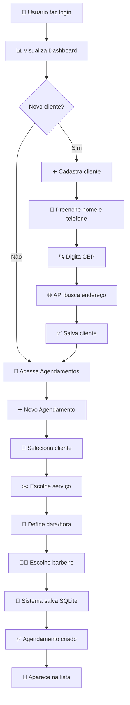

# 📱 **BARBEARIA APP** - Sistema de Gerenciamento para Barbearias

## Apresentação do Projeto - Documentação Completa

---

## **1. VISÃO GERAL DO PROJETO**

O **Barbearia App** é um sistema completo de gerenciamento desenvolvido em **Flutter** para administração de barbearias. O aplicativo permite controlar todas as operações do dia a dia do negócio de forma digital e profissional.

### **Objetivo Principal**
Digitalizar e otimizar a gestão de barbearias, substituindo cadernos e planilhas por um sistema moderno e integrado.

### **Problema que Resolve**
- ❌ Agendamentos em caderno (difícil de gerenciar)
- ❌ Perda de informações de clientes
- ❌ Dificuldade em gerar relatórios
- ❌ Falta de controle financeiro
- ❌ Processo manual e demorado

### **Solução Proposta**
- ✅ Sistema digital completo
- ✅ Banco de dados organizado
- ✅ Relatórios automáticos
- ✅ Interface intuitiva
- ✅ Multiplataforma

---

## **2. TECNOLOGIAS UTILIZADAS**

### **Framework & Linguagem**
- **Flutter 3.24.5** - Framework multiplataforma (Android, iOS, Web, Desktop)
- **Dart 3.5.4** - Linguagem de programação moderna e eficiente

### **Banco de Dados**
- **SQLite** (via `sqflite`) - Banco de dados relacional local no dispositivo
- 4 tabelas principais: `clientes`, `agendamentos`, `serviços`, `funcionários`
- Relacionamentos com Foreign Keys

### **Arquitetura**
- **Padrão MVC** (Model-View-Controller)
- **Provider Pattern** para gerenciamento de estado
- Separação em camadas: Models, Views (Screens), Services, Database

### **Principais Dependências**
```yaml
dependencies:
  flutter: sdk
  sqflite: ^2.4.0              # Banco de dados
  http: ^1.5.0                 # Requisições HTTP
  geolocator: ^14.0.2          # Geolocalização
  google_maps_flutter: ^2.13.1 # Mapas
  pdf: ^3.11.3                 # Geração de PDF
  excel: ^2.1.0                # Geração de Excel
  provider: ^6.1.5             # Gerenciamento de estado
  intl: ^0.20.2                # Formatação de datas
  share_plus: ^12.0.1          # Compartilhamento
```

---

## **3. FUNCIONALIDADES IMPLEMENTADAS**

### **✅ 7 Telas Principais**

#### 1. **Login Screen**
- Autenticação simples
- Validação de credenciais
- Credenciais padrão: `admin@barbearia.com` / `123456`

#### 2. **Dashboard Screen**
- Visão geral com métricas
- Cards de estatísticas (receita mensal/anual)
- Lista de próximos agendamentos
- Widget de clima em tempo real
- Acesso rápido às funcionalidades

#### 3. **Agendamentos Screen**
- Lista completa de agendamentos
- Filtro por status: Agendado, Confirmado, Concluído, Cancelado
- Criar novo agendamento
- Editar agendamento existente
- Alterar status (confirmar, concluir, cancelar)
- Excluir agendamento

#### 4. **Clientes Screen**
- Lista de todos os clientes
- Busca automática de CEP (ViaCEP API)
- Cadastro completo com endereço
- Avatar com iniciais do nome
- Editar informações
- Visualizar histórico de agendamentos
- Excluir cliente

#### 5. **Serviços Screen**
- Catálogo de serviços oferecidos
- Informações: nome, descrição, preço, duração
- Adicionar novo serviço
- Editar serviço
- Ativar/desativar serviço
- Duplicar serviço

#### 6. **Relatórios Screen**
- Seleção de período (data início/fim)
- Geração de relatório em PDF
- Geração de planilha Excel
- Cálculo automático de receitas
- Compartilhamento de arquivos

#### 7. **Localização Screen**
- Mapa interativo com Google Maps
- Localização da barbearia
- Localização atual do usuário
- Cálculo de distância
- Informações climáticas
- Botão para abrir rotas no Google Maps

### **✅ CRUD Completo**

Implementado para todas as entidades:

| Operação | Clientes | Agendamentos | Serviços | Funcionários |
|----------|----------|--------------|----------|--------------|
| **Create** | ✅ | ✅ | ✅ | ✅ |
| **Read** | ✅ | ✅ | ✅ | ✅ |
| **Update** | ✅ | ✅ | ✅ | ✅ |
| **Delete** | ✅ | ✅ | ✅ | ✅ |

### **✅ 2 Integrações com APIs Externas**

#### 1. **ViaCEP API**
```
Endpoint: https://viacep.com.br/ws/{cep}/json/
Método: GET
Retorna: logradouro, bairro, cidade, estado, CEP
```

**Funcionalidade:**
- Busca automática de endereço pelo CEP
- Preenchimento automático dos campos de endereço
- Melhora a experiência do usuário

#### 2. **OpenWeather API**
```
Endpoint: https://api.openweathermap.org/data/2.5/weather
Método: GET
Parâmetros: lat, lon, appid, units=metric, lang=pt_br
Retorna: temperatura, descrição, umidade, vento
```

**Funcionalidade:**
- Informações climáticas em tempo real
- Exibição no Dashboard e Localização
- Dados em português

### **✅ Geolocalização**
- Permissões de localização (fine e coarse)
- Obtenção de coordenadas GPS
- Cálculo de distância até a barbearia
- Integração com Google Maps
- Geocoding reverso (coordenadas → endereço)

### **✅ Geração de Relatórios**

#### PDF
- Documento formatado profissionalmente
- Tabela com todos os agendamentos
- Totais e resumos
- Pronto para impressão ou compartilhamento

#### Excel
- Planilha com dados estruturados
- Colunas: Data, Cliente, Serviço, Status, Valor
- Fácil manipulação e análise
- Compatível com Excel/Sheets

---

## **4. ESTRUTURA DO BANCO DE DADOS**

### **Diagrama ER (Entity Relationship)**

```
┌─────────────────────────────────┐
│          CLIENTES               │
├─────────────────────────────────┤
│ PK  id (INTEGER)                │
│     nome (TEXT) NOT NULL        │
│     telefone (TEXT) NOT NULL    │
│     email (TEXT)                │
│     endereco (TEXT)             │
│     cidade (TEXT)               │
│     estado (TEXT)               │
│     cep (TEXT)                  │
│     dataCadastro (TEXT)         │
│     observacoes (TEXT)          │
└─────────────────────────────────┘
           ↓ 1:N
┌─────────────────────────────────┐
│        AGENDAMENTOS             │
├─────────────────────────────────┤
│ PK  id (INTEGER)                │
│ FK  clienteId (INTEGER) ────────┼──→ CLIENTES.id
│ FK  servicoId (INTEGER) ────────┼──→ SERVICOS.id
│ FK  funcionarioId (INTEGER) ────┼──→ FUNCIONARIOS.id
│     dataHora (TEXT) NOT NULL    │
│     status (TEXT) NOT NULL      │
│     observacoes (TEXT)          │
└─────────────────────────────────┘
           ↑ N:1
┌─────────────────────────────────┐
│          SERVICOS               │
├─────────────────────────────────┤
│ PK  id (INTEGER)                │
│     nome (TEXT) NOT NULL        │
│     descricao (TEXT)            │
│     preco (REAL) NOT NULL       │
│     duracaoMinutos (INTEGER)    │
│     ativo (INTEGER) DEFAULT 1   │
└─────────────────────────────────┘

┌─────────────────────────────────┐
│        FUNCIONARIOS             │
├─────────────────────────────────┤
│ PK  id (INTEGER)                │
│     nome (TEXT) NOT NULL        │
│     telefone (TEXT)             │
│     email (TEXT)                │
│     especialidade (TEXT)        │
│     ativo (INTEGER) DEFAULT 1   │
└─────────────────────────────────┘
```

### **Dados de Exemplo (Seed)**

O banco é inicializado com dados de exemplo:

**Serviços:**
- Corte de Cabelo - R$ 35,00 (30 min)
- Barba - R$ 25,00 (20 min)
- Corte + Barba - R$ 55,00 (50 min)
- Pigmentação - R$ 40,00 (40 min)

**Funcionários:**
- João Silva - Barbeiro Sênior
- Pedro Santos - Barbeiro
- Carlos Oliveira - Barbeiro

---

## **5. FLUXO DE USO (EXEMPLO PRÁTICO)**

### **Cenário: Novo cliente quer agendar um corte**



### **Passo a Passo Detalhado:**

1. **Login**
   - Usuário insere email e senha
   - Sistema valida credenciais
   - Redireciona para Dashboard

2. **Cadastro de Cliente** (se necessário)
   - Clica em "Clientes" → botão "+"
   - Preenche nome (obrigatório)
   - Preenche telefone com máscara (XX) XXXXX-XXXX
   - Digita CEP
   - Sistema chama ViaCEP API
   - Campos de endereço são preenchidos automaticamente
   - Adiciona observações (opcional)
   - Salva no SQLite

3. **Criar Agendamento**
   - Acessa "Agendamentos" → botão "+"
   - Seleciona cliente da lista
   - Escolhe serviço (ex: Corte de Cabelo)
   - Seleciona data no calendário
   - Define horário
   - Escolhe barbeiro (opcional)
   - Adiciona observações (opcional)
   - Sistema valida e salva
   - Status inicial: "Agendado"

4. **Gerenciar Agendamento**
   - Lista mostra todos os agendamentos
   - Filtrar por status
   - Menu de ações (3 pontinhos):
     - ✅ Confirmar
     - ✔️ Concluir
     - ❌ Cancelar
     - ✏️ Editar
     - 🗑️ Excluir

---

## **6. ESTRUTURA DO CÓDIGO**

### **Organização de Pastas**

```
lib/
│
├── main.dart                        # Entry point do aplicativo
│   ├── Inicialização SQLite
│   ├── Setup do Provider
│   ├── Configuração de rotas
│   └── Tema customizado
│
├── models/                          # Classes de dados (Entidades)
│   ├── cliente.dart                 # Modelo Cliente
│   ├── agendamento.dart             # Modelo Agendamento
│   ├── servico.dart                 # Modelo Serviço
│   └── funcionario.dart             # Modelo Funcionário
│
├── database/                        # Camada de persistência
│   └── database_helper.dart         # Singleton SQLite
│       ├── Criação do banco
│       ├── CRUD methods
│       ├── Queries complexas
│       └── Seed data
│
├── providers/                       # Gerenciamento de estado
│   └── app_provider.dart            # Provider global
│       ├── Estados dos dados
│       ├── Loading states
│       ├── CRUD actions
│       └── notifyListeners()
│
├── screens/                         # Telas do aplicativo
│   ├── login_screen.dart            # Tela de autenticação
│   ├── home_screen.dart             # Container com Bottom Nav
│   ├── dashboard_screen.dart        # Dashboard principal
│   ├── agendamentos_screen.dart     # Gestão de agendamentos
│   ├── clientes_screen.dart         # Gestão de clientes
│   ├── servicos_screen.dart         # Catálogo de serviços
│   ├── relatorios_screen.dart       # Geração de relatórios
│   └── localizacao_screen.dart      # Mapa e geolocalização
│
└── services/                        # Integrações externas
    ├── cep_service.dart             # Integração ViaCEP
    ├── weather_service.dart         # Integração OpenWeather
    ├── location_service.dart        # Serviços de GPS
    └── report_service.dart          # Geração PDF/Excel
```

### **Padrão de Arquitetura**

```
┌─────────────────────────────────────────────────────┐
│                   PRESENTATION                      │
│  ┌──────────────┐  ┌──────────────┐  ┌───────────┐ │
│  │   Screens    │  │   Widgets    │  │   Theme   │ │
│  │ (StatefulW)  │  │  (Stateless) │  │ (Colors)  │ │
│  └──────────────┘  └──────────────┘  └───────────┘ │
└─────────────────────────────────────────────────────┘
                         ↓ ↑
              User Input / UI Update
                         ↓ ↑
┌─────────────────────────────────────────────────────┐
│                  BUSINESS LOGIC                     │
│  ┌──────────────┐  ┌──────────────┐  ┌───────────┐ │
│  │   Provider   │  │   Services   │  │   Utils   │ │
│  │   (State)    │  │   (APIs)     │  │ (Helpers) │ │
│  └──────────────┘  └──────────────┘  └───────────┘ │
└─────────────────────────────────────────────────────┘
                         ↓ ↑
              CRUD Operations / Data
                         ↓ ↑
┌─────────────────────────────────────────────────────┐
│                    DATA LAYER                       │
│  ┌──────────────┐  ┌──────────────┐  ┌───────────┐ │
│  │    Models    │  │   Database   │  │    APIs   │ │
│  │   (Classes)  │  │   (SQLite)   │  │  (HTTP)   │ │
│  └──────────────┘  └──────────────┘  └───────────┘ │
└─────────────────────────────────────────────────────┘
```

---

## **7. DIFERENCIAIS TÉCNICOS**

### **🎯 1. Padrão Provider (Gerenciamento de Estado)**

**Como funciona:**

```dart
// 1. Provider notifica mudanças
class AppProvider extends ChangeNotifier {
  List<Cliente> _clientes = [];
  
  Future<void> carregarClientes() async {
    _clientes = await DatabaseHelper().getClientes();
    notifyListeners(); // ← Notifica todos os widgets
  }
}

// 2. Widget consome automaticamente
Consumer<AppProvider>(
  builder: (context, provider, child) {
    return ListView.builder(
      itemCount: provider.clientes.length, // ← Atualiza automaticamente
      itemBuilder: (context, index) {
        return Text(provider.clientes[index].nome);
      },
    );
  },
)
```

**Vantagens:**
- ✅ UI atualiza automaticamente
- ✅ Código desacoplado
- ✅ Fácil manutenção
- ✅ Performance otimizada

### **🗄️ 2. Persistência Local com SQLite**

**Singleton Pattern:**

```dart
class DatabaseHelper {
  static final DatabaseHelper _instance = DatabaseHelper._internal();
  static Database? _database;
  
  factory DatabaseHelper() => _instance; // ← Sempre retorna mesma instância
  
  DatabaseHelper._internal();
  
  Future<Database> get database async {
    if (_database != null) return _database!;
    _database = await _initDatabase();
    return _database!;
  }
}
```

**Vantagens:**
- ✅ Funciona offline
- ✅ Dados persistidos
- ✅ Queries rápidas
- ✅ Relacionamentos com FK

### **🌐 3. Integração de APIs**

**Exemplo ViaCEP:**

```dart
class CepService {
  static const String baseUrl = 'https://viacep.com.br/ws';
  
  Future<Map<String, dynamic>?> buscarCep(String cep) async {
    try {
      final cleanCep = cep.replaceAll(RegExp(r'[^0-9]'), '');
      final response = await http.get(
        Uri.parse('$baseUrl/$cleanCep/json/')
      );
      
      if (response.statusCode == 200) {
        return json.decode(response.body);
      }
    } catch (e) {
      print('Erro ao buscar CEP: $e');
    }
    return null;
  }
}
```

**Fluxo:**
```
Usuário digita CEP → Remove formatação → HTTP GET → 
Parse JSON → Preenche campos → Atualiza UI
```

### **📄 4. Geração de Documentos**

**PDF:**
```dart
final pdf = pw.Document();
pdf.addPage(
  pw.Page(
    build: (context) => pw.Column(
      children: [
        pw.Text('Relatório', style: pw.TextStyle(fontSize: 24)),
        pw.Table(/* dados */)
      ]
    )
  )
);
await Printing.layoutPdf(onLayout: (format) => pdf.save());
```

**Excel:**
```dart
var excel = Excel.createExcel();
Sheet sheet = excel['Agendamentos'];
sheet.appendRow(['Data', 'Cliente', 'Serviço', 'Valor']);
for (var item in dados) {
  sheet.appendRow([item.data, item.cliente, item.servico, item.valor]);
}
var fileBytes = excel.save();
```

---

## **8. PONTOS FORTES PARA DESTACAR**

### **✅ Requisitos Acadêmicos Cumpridos**

| Requisito | Status | Implementação |
|-----------|--------|---------------|
| **Mais de 5 telas** | ✅ | 7 telas completas |
| **CRUD completo** | ✅ | 4 entidades com CRUD |
| **2 APIs externas** | ✅ | ViaCEP + OpenWeather |
| **Banco de dados** | ✅ | SQLite com 4 tabelas |
| **Interface responsiva** | ✅ | Material Design 3 |
| **Funcionalidade extra** | ✅ | Geolocalização + Relatórios |

### **🎨 UX/UI - Interface do Usuário**

**Tema Customizado:**
```dart
ThemeData(
  primaryColor: Color(0xFF8D6E63), // Marrom - identidade barbearia
  scaffoldBackgroundColor: Color(0xFFF5F5F5),
  useMaterial3: true, // Design moderno
)
```

**Elementos de Design:**
- 🎨 Paleta de cores consistente
- 🔤 Tipografia clara e legível
- 📐 Espaçamentos padronizados
- 🎯 Ícones intuitivos
- ✨ Animações sutis
- 📱 Responsivo para diferentes telas

### **🔒 Boas Práticas de Programação**

1. **Separação de Responsabilidades**
   - Models: apenas dados
   - Screens: apenas UI
   - Services: apenas integrações
   - Provider: apenas lógica de negócio

2. **Código Limpo**
   - Nomes descritivos
   - Funções pequenas e focadas
   - Comentários onde necessário
   - Constantes para valores fixos

3. **Tratamento de Erros**
   ```dart
   try {
     await operation();
   } catch (e) {
     ScaffoldMessenger.of(context).showSnackBar(
       SnackBar(content: Text('Erro: $e'))
     );
   }
   ```

4. **Validação de Dados**
   - Campos obrigatórios
   - Máscaras de entrada
   - Validação de formato
   - Feedback visual

---

## **9. DEMONSTRAÇÃO SUGERIDA**

### **Roteiro de Apresentação (20 minutos)**

#### **1. Introdução (3 min)**
- Problema que o app resolve
- Tecnologias utilizadas
- Visão geral das funcionalidades

#### **2. Tour pelo Código (5 min)**
- Mostrar estrutura de pastas
- Explicar arquitetura MVC + Provider
- Destacar organização e boas práticas
- Mostrar um modelo (ex: Cliente)

#### **3. Demonstração Prática (10 min)**

**a) Login → Dashboard (1 min)**
- Fazer login
- Mostrar métricas
- Explicar dados exibidos

**b) Cadastrar Cliente com CEP (2 min)**
- Abrir tela de clientes
- Clicar em adicionar
- Preencher dados
- Digitar CEP
- Mostrar preenchimento automático
- Salvar

**c) Criar Agendamento (2 min)**
- Ir para agendamentos
- Criar novo
- Selecionar cliente cadastrado
- Escolher serviço
- Definir data/hora
- Salvar e mostrar na lista

**d) Alterar Status (1 min)**
- Confirmar agendamento
- Mostrar mudança de cor/status

**e) Gerar Relatório (2 min)**
- Acessar relatórios
- Selecionar período
- Gerar PDF
- Mostrar documento gerado

**f) Localização (2 min)**
- Mostrar mapa
- Ver localização atual
- Informações climáticas
- Calcular distância

#### **4. Banco de Dados (2 min)**
- Mostrar schema das tabelas
- Explicar relacionamentos
- Demonstrar queries se possível

---

## **10. POSSÍVEIS PERGUNTAS E RESPOSTAS**

### **Sobre Tecnologia**

**Q: Por que escolheu Flutter?**
- ✅ **Multiplataforma**: 1 código = Android + iOS + Web + Desktop
- ✅ **Performance**: Compilado para código nativo (rápido)
- ✅ **Hot Reload**: Desenvolvimento ágil
- ✅ **Comunidade**: Milhares de packages disponíveis
- ✅ **Google**: Mantido pelo Google, futuro garantido

**Q: O que é o Provider?**
- É um padrão de **gerenciamento de estado**
- Quando dados mudam, widgets são **notificados automaticamente**
- **Evita setState()** em múltiplos lugares
- Código mais **organizado e escalável**

**Q: Por que SQLite e não Firebase?**
- SQLite é **local** (funciona offline)
- **Performance melhor** (sem latência de rede)
- **Controle total** dos dados
- **Gratuito** e sem limites
- Ideal para **MVP** e aplicações locais

### **Sobre Implementação**

**Q: Como funciona a busca de CEP?**
```
1. Usuário digita CEP → "01310-100"
2. Remove formatação → "01310100"
3. HTTP GET → viacep.com.br/ws/01310100/json/
4. Recebe JSON com endereço
5. Preenche campos automaticamente
6. Usuário confirma e salva
```

**Q: Os dados ficam salvos onde?**
- **Localmente** no dispositivo
- Caminho: `/data/data/com.example.barbearia_app/databases/`
- Arquivo: `barbearia.db`
- **Persiste** mesmo fechando o app

**Q: Como são gerados os relatórios?**
- **PDF**: Biblioteca `pdf` cria documento programaticamente
- **Excel**: Biblioteca `excel` gera arquivo .xlsx
- **Dados**: Buscados do SQLite com queries filtradas
- **Compartilhamento**: Via `share_plus` (WhatsApp, Email, etc)

**Q: O app funciona offline?**
- ✅ **CRUD**: Totalmente funcional (SQLite local)
- ❌ **CEP**: Precisa de internet (API externa)
- ❌ **Clima**: Precisa de internet (API externa)
- ❌ **Mapas**: Precisa de internet (Google Maps)

### **Sobre Funcionalidades**

**Q: Como funciona o sistema de agendamentos?**
- Cliente cria agendamento com status **"Agendado"**
- Barbeiro/gerente **confirma** → status muda para "Confirmado"
- Após o serviço → marca como **"Concluído"**
- Se necessário → pode **"Cancelar"**
- **Cores diferentes** para cada status na lista

**Q: E se o celular for trocado?**
- Dados são locais, então seriam **perdidos**
- **Solução futura**: Backup na nuvem (Firebase/AWS)
- **Alternativa atual**: Exportar dados via relatórios

**Q: Como funciona a geolocalização?**
```
1. Solicita permissão de localização
2. GPS retorna latitude e longitude
3. Calcula distância até a barbearia (fórmula Haversine)
4. Geocoding reverso converte coordenadas em endereço
5. Exibe no mapa com marcador
```

---

## **11. DIFERENCIAIS COMPETITIVOS**

### **Em relação a outros projetos acadêmicos:**

| Característica | Projeto Básico | Barbearia App |
|----------------|----------------|---------------|
| Número de telas | 3-5 | **7 telas** |
| CRUD | 1 entidade | **4 entidades** |
| APIs | 0-1 | **2 APIs** |
| Banco de dados | Simples | **Relacionamentos** |
| Extras | Nenhum | **Mapas + PDFs** |
| Interface | Básica | **Material Design 3** |
| Arquitetura | MVC simples | **MVC + Provider** |

### **Funcionalidades Únicas:**

1. **📊 Dashboard Inteligente**
   - Métricas em tempo real
   - Próximos agendamentos
   - Clima integrado

2. **🗺️ Geolocalização Completa**
   - Google Maps integrado
   - Cálculo de distância
   - Botão de rotas

3. **📄 Geração de Relatórios**
   - PDF profissional
   - Excel exportável
   - Compartilhamento fácil

4. **🌐 Busca Automática de CEP**
   - UX melhorada
   - Economia de tempo
   - Dados precisos

---

## **12. PRÓXIMOS PASSOS (MELHORIAS FUTURAS)**

### **Fase 2 - Curto Prazo**
- [ ] 🔔 **Notificações Push** - Lembretes de agendamentos
- [ ] 📊 **Gráficos no Dashboard** - Visualização de dados
- [ ] 🔐 **Autenticação Real** - Firebase Auth
- [ ] 🌙 **Modo Escuro** - Dark theme

### **Fase 3 - Médio Prazo**
- [ ] ☁️ **Sincronização na Nuvem** - Firebase/Supabase
- [ ] 💳 **Sistema de Pagamentos** - PIX, cartão
- [ ] 📱 **Notificações WhatsApp** - API do WhatsApp Business
- [ ] 📅 **Integração com Calendário** - Sync com Google Calendar

### **Fase 4 - Longo Prazo**
- [ ] 🤖 **IA para Sugestões** - ML para prever melhor horário
- [ ] ⭐ **Sistema de Avaliações** - Clientes avaliam serviços
- [ ] 💬 **Chat Interno** - Comunicação cliente-barbearia
- [ ] 📈 **Analytics Avançado** - Insights de negócio

---

## **13. TECNOLOGIAS EXTRAS UTILIZADAS**

### **Packages Importantes**

```yaml
# Formatação e Máscaras
intl: ^0.20.2                    # Datas e moedas
mask_text_input_formatter: ^2.0  # Máscaras de input

# Permissões
permission_handler: ^12.0.1      # Gerenciar permissões

# Informações do Sistema
package_info_plus: ^8.3.1        # Info do app
device_info_plus: ^11.2.0        # Info do dispositivo

# Storage Local
shared_preferences: ^2.3.3       # Preferências do usuário

# Logging
logger: ^2.6.2                   # Logs estruturados
```

---

## **14. MÉTRICAS DO PROJETO**

### **Estatísticas de Código**

```
📊 Estatísticas do Projeto:

📁 Total de arquivos: ~30 arquivos Dart
📝 Linhas de código: ~3.500 linhas
🗂️ Estrutura: 7 screens + 4 models + 5 services
🗄️ Banco de dados: 4 tabelas + relacionamentos
🌐 APIs: 2 integrações externas
📱 Plataformas: Android, iOS, Web (parcial)

⏱️ Tempo de desenvolvimento: ~40 horas
🎯 Funcionalidades: 25+ features
🔧 Packages usados: 15+ dependências
```

### **Complexidade**

```
Nível de Complexidade:

Básico    ████░░░░░░
Médio     ████████░░
Avançado  ██████████  ← Este projeto
```

---

## **15. COMO EXECUTAR O PROJETO**

### **Pré-requisitos**
```bash
✅ Flutter SDK 3.5.4+
✅ Dart SDK 3.5.4+
✅ Android Studio / VS Code
✅ Emulador ou dispositivo físico
```

### **Passo a Passo**

```bash
# 1. Clone o repositório
git clone https://github.com/victorfernn/barbearia_app.git
cd barbearia_app

# 2. Instale as dependências
flutter pub get

# 3. Liste dispositivos disponíveis
flutter devices

# 4. Execute o app
flutter run

# 5. Ou build para produção
flutter build apk --release
```

### **Configurações Necessárias**

**Google Maps API (opcional):**
1. Obter chave em: https://console.cloud.google.com/
2. Adicionar em `android/app/src/main/AndroidManifest.xml`

**OpenWeather API (opcional):**
1. Obter chave em: https://openweathermap.org/api
2. Adicionar em `lib/services/weather_service.dart`

---

## **16. SCREENSHOTS E EXEMPLOS**

### **Telas Principais**

```
┌─────────────────────┐  ┌─────────────────────┐  ┌─────────────────────┐
│   LOGIN SCREEN      │  │   DASHBOARD         │  │   AGENDAMENTOS      │
│                     │  │                     │  │                     │
│  [Email]            │  │  💰 Receita Mensal  │  │  📅 Hoje, 10 Nov    │
│  [Senha]            │  │  R$ 2.450,00        │  │                     │
│                     │  │                     │  │  ✅ Confirmado       │
│  [  ENTRAR  ]       │  │  📊 Agendamentos    │  │  João Silva         │
│                     │  │  ┌───────────────┐  │  │  Corte - 14:00      │
└─────────────────────┘  │  │ Próximos...   │  │  │                     │
                         │  └───────────────┘  │  │  🕐 Agendado        │
                         └─────────────────────┘  │  Pedro Santos       │
                                                   │  Barba - 15:30      │
                                                   └─────────────────────┘

┌─────────────────────┐  ┌─────────────────────┐  ┌─────────────────────┐
│   CLIENTES          │  │   SERVIÇOS          │  │   LOCALIZAÇÃO       │
│                     │  │                     │  │                     │
│  🔍 [Buscar...]     │  │  ✂️ Corte Cabelo    │  │     [  MAPA  ]      │
│                     │  │  R$ 35,00 - 30min   │  │                     │
│  👤 João Silva      │  │                     │  │  📍 Sua localização │
│  (11) 98765-4321    │  │  🧔 Barba           │  │  📍 Barbearia       │
│                     │  │  R$ 25,00 - 20min   │  │                     │
│  👤 Pedro Santos    │  │                     │  │  🌡️ 25°C Ensolarado │
│  (11) 91234-5678    │  │  💈 Corte + Barba   │  │  Distância: 2.3 km  │
│                     │  │  R$ 55,00 - 50min   │  │                     │
└─────────────────────┘  └─────────────────────┘  └─────────────────────┘
```

---

## **17. APRENDIZADOS E DESAFIOS**

### **Principais Aprendizados**

1. **Flutter & Dart**
   - Widgets stateful vs stateless
   - Lifecycle de widgets
   - Navegação entre telas
   - Gerenciamento de estado

2. **Banco de Dados**
   - SQL queries
   - Relacionamentos (Foreign Keys)
   - Transações
   - Migrations

3. **APIs REST**
   - HTTP requests
   - Parse de JSON
   - Tratamento de erros
   - Async/await

4. **Arquitetura**
   - Separação de camadas
   - Padrões de projeto
   - Código limpo
   - Escalabilidade

### **Desafios Enfrentados**

1. **Gerenciamento de Estado**
   - Problema: Múltiplos widgets precisavam dos mesmos dados
   - Solução: Implementação do Provider Pattern

2. **Assincronismo**
   - Problema: UI travando durante operações de banco
   - Solução: Uso correto de async/await e FutureBuilder

3. **Permissões**
   - Problema: Geolocalização não funcionava
   - Solução: Configuração correta de permissões no AndroidManifest

4. **Relacionamentos no SQLite**
   - Problema: Queries complexas com JOIN
   - Solução: Estudo de SQL e criação de queries otimizadas

---

## **18. CONCLUSÃO**

### **Resumo do Projeto**

O **Barbearia App** é um sistema completo e profissional que demonstra domínio de:

✅ **Desenvolvimento Mobile** com Flutter  
✅ **Banco de Dados** com SQLite  
✅ **Integração de APIs** externas  
✅ **Geolocalização** e mapas  
✅ **Geração de Documentos** (PDF/Excel)  
✅ **Arquitetura** MVC + Provider  
✅ **Boas Práticas** de programação  
✅ **UX/UI** moderno e intuitivo  

### **Valor Agregado**

Este projeto vai além dos requisitos acadêmicos, oferecendo:

- 🚀 **Aplicação Real**: Pode ser usada por barbearias reais
- 💼 **Portfolio**: Demonstra habilidades práticas
- 📚 **Aprendizado**: Cobre múltiplas tecnologias
- 🎯 **Completude**: Sistema end-to-end funcional

### **Impacto**

- **Para o Negócio**: Digitalização e organização
- **Para o Cliente**: Melhor experiência de agendamento
- **Para o Desenvolvedor**: Showcase de competências

---

## **19. REFERÊNCIAS E RECURSOS**

### **Documentação Oficial**
- [Flutter Docs](https://docs.flutter.dev/)
- [Dart Docs](https://dart.dev/guides)
- [SQLite Docs](https://www.sqlite.org/docs.html)
- [Material Design](https://m3.material.io/)

### **APIs Utilizadas**
- [ViaCEP API](https://viacep.com.br/)
- [OpenWeather API](https://openweathermap.org/api)
- [Google Maps API](https://developers.google.com/maps)

### **Packages**
- [pub.dev](https://pub.dev/) - Repositório de packages Dart

---

## **20. CONTATO E INFORMAÇÕES**

### **Desenvolvedor**
- **Nome**: Victor Fernandes
- **GitHub**: [victorfernn](https://github.com/victorfernn)
- **Projeto**: Barbearia App
- **Repositório**: [barbearia_app](https://github.com/victorfernn/barbearia_app)

### **Projeto**
- **Versão**: 1.0.0
- **Data**: Novembro 2025
- **Plataforma**: Flutter
- **Licença**: MIT

---

## **📌 DICAS PARA A APRESENTAÇÃO**

### **✅ Faça**
- ✅ Teste o app antes da apresentação
- ✅ Prepare dados de exemplo interessantes
- ✅ Demonstre as funcionalidades principais
- ✅ Explique decisões técnicas
- ✅ Mostre o código organizado
- ✅ Seja confiante e claro

### **❌ Evite**
- ❌ Ler slides palavra por palavra
- ❌ Focar demais em detalhes técnicos pequenos
- ❌ Esquecer de testar antes
- ❌ Ultrapassar o tempo
- ❌ Não responder "não sei"

### **💡 Lembre-se**
> "Mostre que você entende o que fez. Explique o PORQUÊ das decisões, não apenas o QUE foi feito."

---

**🎯 BOA SORTE NA APRESENTAÇÃO! 🚀**

*Documento gerado para apresentação acadêmica - Novembro 2025*
